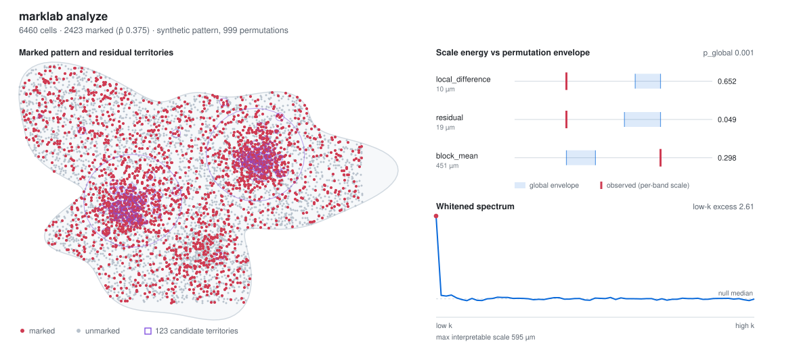

# Marklab

[](https://github.com/jcwal1516/gsc-marklab/actions/workflows/ci.yml)
[](https://github.com/jcwal1516/gsc-marklab/actions/workflows/release.yml)
[](https://github.com/jcwal1516/gsc-marklab/actions/workflows/calibration.yml)
[](rust-toolchain.toml)
[](#license)

**Section-level spatial statistics for marked cell patterns in pathology.**

<p align="center">
  <picture>
    <source media="(prefers-color-scheme: dark)" srcset="docs/assets/marklab-overview-dark.svg">
    
  </picture>
</p>

<p align="center">
  <sub><code>marklab analyze</code> on a <a href="docs/assets/make_synthetic_input.py">synthetic</a> pattern
  (6,460 cells, 999 permutations, shipped <a href="examples/config.toml">examples/config.toml</a>).
  Every plotted value is read from the run's <code>result.json</code>. Not patient data.</sub>
</p>

Marklab is a Rust library and CLI that reports organization, dispersion, anisotropy,
multiscale residual diagnostics, and descriptive pre/post differences relative to
fixed-position random labeling. The multimodal workflow has first-class MMR-IHC
inputs, but the core marked-pattern analysis is not tied to one marker.

For the wider method catalog, supported workflows, and current scientific limits, start with
[Capabilities and current evidence](docs/capabilities.md). `marklab --help` lists every enabled
command family; `marklab backend doctor` checks a Python backend installation.

For a complete multiplex panel-to-patient analysis, use the
[multiplex study guide](docs/multiplex-study.md). Its synthetic example connects nullable assay
channels, spatial summaries, patient-level inference, resumable execution and reports through one
library service, with a thin Python/AnnData client.

## Scope

| Marklab does | Marklab does not |
| --- | --- |
| Quantify organization, dispersion, and anisotropy of marked patterns | Prove clonality |
| Report multiscale residual diagnostics as typed, named heuristics | Track the same cells between sections |
| Compare pre/post sections descriptively | Infer MMR gain or loss |
| Run permutation inference against fixed-position random labeling | Perform segmentation |
| Read WSI metadata and extract bounded RGBA regions | Determine molecular MMR status |

Every reported endpoint is typed as available or unavailable with a reason. Degenerate
inputs produce typed results rather than silent fallbacks.

## Requirements

- Rust 1.96 (pinned in [`rust-toolchain.toml`](rust-toolchain.toml))
- The committed lockfile for official CLI and release-archive builds
- Optional `wsi` feature for slide inspection and bounded RGBA region extraction

## Build and test

```bash
cargo +1.96.0 build --locked --features wsi
cargo +1.96.0 test --all-features
```

The default feature set is `cli`, `parallel`, `csv`, and `parquet`. WSI is intentionally
default-off for library users; official release binaries enable it with
`--features wsi --locked`.

## Quick start

Analyze a marked pattern:

```bash
marklab analyze \
  --cells cells.parquet \
  --mask tumor_mask.geojson \
  --config examples/config.toml \
  --out out/case_001_post
```

Run the classical spatial-pathology workflow (homogeneous Ripley K/L with border
correction and deterministic CSR):

```bash
marklab classical \
  --cells cells.parquet --mask tumor_mask.geojson --out out/case_001_classical \
  --r-max-um 100 --r-steps 50 --simulations 999 --seed 123456789 --alpha 0.05 \
  --memory-budget-mib 512 --max-pair-visits 100000000 --max-csr-draws 10000000
```

Inspect a slide and extract a region (requires `--features wsi`):

```bash
marklab inspect-slide slide.svs --output metadata.json
marklab extract-region slide.svs \
  --scene 0 --series 0 --level 0 --z 0 --c 0 --t 0 \
  --x 0 --y 0 --width 1024 --height 1024 --output region.png
```

From Rust:

```rust
use marklab::{AnalysisConfig, AnalysisEngine, MarkedPatternResult, Pattern};

fn run(pattern: &Pattern) -> marklab::Result<MarkedPatternResult> {
    let engine = AnalysisEngine::new(AnalysisConfig::default())?;
    engine.analyze_pattern(pattern)
}
```

## Command surface

| Family | Commands |
| --- | --- |
| Core analysis | `analyze`, `batch`, `prepost`, `classical`, `nearest-space` |
| Multimodal | `multimodal` (registration, factor models, cross-interaction) |
| Cohort and population | `cohort` |
| Bayesian | `bayes`, `project` (hierarchical models, SBC, sensitivity) |
| Causal and longitudinal | `causal`, `longitudinal` |
| Geometry and structure | `spatial3d`, `topology`, `graph`, `registration` |
| Simulation | `simulate`, `neural` |
| Operations | `smoke`, `policy`, `numerics`, `profile-plan` |
| WSI | `inspect-slide`, `extract-region` |

Run `marklab <family> --help` for the subcommands and required flags of each family.

Root and family help include the complete composed command catalog. Python-backed methods use
separately installed, locked environments; run `marklab backend doctor` to inspect admission and
see [Python backend installation](docs/python-backends.md) for extracted binaries and checkouts.

## Workspace

| Crate | Purpose |
| --- | --- |
| [`marklab-core`](crates/marklab-core) | Typed identities and foundational contracts |
| [`marklab-data`](crates/marklab-data) | Typed cohort hierarchy and data contracts |
| [`marklab-numerics`](crates/marklab-numerics) | Stable bounded numerical primitives |
| [`marklab-project`](crates/marklab-project) | Content identity and minimal project state |
| [`marklab-workflow`](crates/marklab-workflow) | Typed local workflow graph and scheduler |
| [`marklab-embeddings`](crates/marklab-embeddings) | Canonical embedding artifacts and bounded import |
| [`marklab-cohort`](crates/marklab-cohort) | Cohort-valid population inference |
| [`marklab-bayes`](crates/marklab-bayes) | Typed Bayesian model and fit contracts |
| [`marklab-sbi`](crates/marklab-sbi) | Bounded simulation-based inference workflows |
| [`marklab-simulation`](crates/marklab-simulation) | Mechanistic tissue simulation contracts and solvers |
| [`marklab-causal`](crates/marklab-causal) | Bounded causal-design research workflows |
| [`marklab-longitudinal`](crates/marklab-longitudinal) | Bounded longitudinal state-space workflows |
| [`marklab-spatial3d`](crates/marklab-spatial3d) | Dimension-aware bounded 3-D spatial statistics |
| [`marklab-graph`](crates/marklab-graph) | Canonical bounded graph mathematics |
| [`marklab-topology`](crates/marklab-topology) | Pinned-backend topology workflows |
| [`marklab-policy`](crates/marklab-policy) | Machine-readable execution and maturity policies |

## Results

Result documents use format 0.3:

```json
{
  "format_version": "0.3",
  "provenance": {},
  "analysis": {
    "kind": "marked_pattern | multimodal | marked_prepost | multimodal_prepost",
    "result": {}
  }
}
```

Run directories are committed transactionally: artifacts are written to a temporary
sibling on the same filesystem and only then promoted, so a failed write never appears
as a successful output directory. `ResultDocument::from_json` converts supported 0.2
marked-pattern documents to 0.3 in memory and rejects states that cannot be converted
without guessing. Both pre/post commands accept either a `result.json` file or its
containing directory.

The [`marklab.classical_spatial`](docs/classical-spatial-workflow.md) family is
versioned separately from format 0.3 and does not affect it.

## Documentation

| Document | Contents |
| --- | --- |
| [SPEC.md](SPEC.md) | Implemented configuration, inference, result, and WSI contracts |
| [docs/result-format-0.3.md](docs/result-format-0.3.md) | Result schema, availability rules, endpoint definitions, 0.2 compatibility boundary |
| [docs/public-api.md](docs/public-api.md) | Supported crate-root Rust surface |
| [docs/classical-spatial-workflow.md](docs/classical-spatial-workflow.md) | Ripley K/L inputs, estimator, window, and interpretation boundary |
| [docs/validation-methodology.md](docs/validation-methodology.md) | Smoke suites, scheduled random-label calibration, and acceptance rules |
| [docs/dependency_advisories.md](docs/dependency_advisories.md) | Reviewed dependency exceptions |

Endpoint methodology — the multiscale residual heuristic, the Hann-tapered raster
periodogram, window length scales, cross-interaction envelopes, and the rigid/affine
registration models — is specified in [SPEC.md](SPEC.md) and
[docs/result-format-0.3.md](docs/result-format-0.3.md). None of these are wavelet,
Difference-of-Gaussians, or Bartlett estimators, and the documents name what each one
actually computes.

## License

Licensed under either of [MIT](LICENSE-MIT) or [Apache-2.0](LICENSE-APACHE) at your
option.
