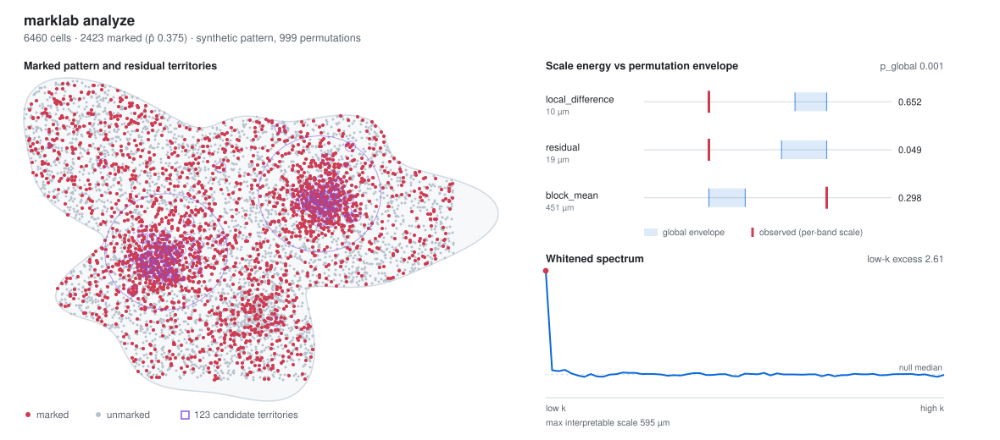

# Marklab

[](https://github.com/jcwal1516/gsc-marklab/actions/workflows/ci.yml)
[](https://github.com/jcwal1516/gsc-marklab/actions/workflows/release.yml)
[](https://github.com/jcwal1516/gsc-marklab/actions/workflows/calibration.yml)
[](rust-toolchain.toml)
[](#license)

**Spatial statistics for labeled cells in tissue sections.**

Marklab answers one question about a tissue section: are the cells with a given label
arranged differently from what chance would produce? Give it the position of every cell
and a label for each one, such as "this tumor cell lost MMR protein staining", and it
tells you whether the labeled cells are clumped together, evenly spread, lined up in one
direction, or concentrated at a particular size scale, and where in the tissue they
concentrate.

It is a command-line tool and Rust library for pathology images, built for H&E and
immunohistochemistry (IHC) slides. Marklab does not find or classify cells. Another tool
(for example a segmentation model such as CellViT) produces the table of cells; Marklab
analyzes it.

<p align="center">
  <picture>
    <source media="(prefers-color-scheme: dark)" srcset="docs/assets/marklab-overview-dark.svg">
    
  </picture>
</p>

<p align="center">
  <sub><code>marklab analyze</code> on a <a href="docs/assets/make_synthetic_input.py">synthetic</a> pattern
  (6,460 cells, 999 permutations, shipped <a href="examples/config.toml">examples/config.toml</a>).
  Every plotted value is read from the run's <code>result.json</code>. Not patient data.</sub>
</p>

## How it works

The test is simple to state. Keep every cell exactly where it is, shuffle which cells carry
the label, and measure the pattern again. Repeat that many times (999 in the example
configuration). If the real section looks unlike almost all of the shuffled versions, the
labeled cells are organized in a way that chance does not explain.

Because cell positions never move, the test asks only about the labels. Dense or sparse
tissue, holes and odd shapes affect the real and shuffled sections equally, so they do not
create false signals.

Several statistics are tested together with global envelopes, which keeps the overall
false-positive rate at the level you set (5% in the example configuration). A fixed random seed makes every
run reproducible: the same input and settings give the same result.

## What it can do

| Question | Command |
| --- | --- |
| Are the labeled cells in this section clustered, dispersed or oriented, and at what scale? Where are the hotspots? | `marklab analyze` |
| How does the pattern differ between a section before treatment and one after? | `marklab prepost` |
| Are all cells, regardless of label, clustered or regular? (Ripley's K and L functions, nearest-neighbor and empty-space distances) | `marklab classical`, `marklab nearest-space` |
| What does an H&E section and an IHC section of the same tissue show together? | `marklab multimodal` |
| Do patient groups differ, counting each patient once rather than each cell? | `marklab cohort`, `marklab study` |
| How do markers and cell types change with distance from annotated structures, and where are local hotspots? | `marklab pathology` |
| What do Bayesian spatial and hierarchical models say? (via pinned PyMC/NumPyro environments) | `marklab bayes`, `marklab project` |
| What is in this whole-slide image, and can I cut out a region? (`--features wsi`) | `marklab inspect-slide`, `marklab extract-region` |

There are also research workflows for 3-D tissue, graphs, topology, time series, causal
designs and simulation. `marklab --help` lists every command, and
`marklab <command> --help` shows its options. [What Marklab can do](docs/capabilities.md)
describes each workflow and how mature it is.

## Quick start

Build with the pinned Rust toolchain:

```bash
cargo +1.99.0 build --locked --release --features wsi
```

You need three inputs:

1. **A cell table** (CSV or Parquet), one row per cell, with these columns:

   | Column | Meaning |
   | --- | --- |
   | `x_um`, `y_um` | Cell position in micrometres |
   | `mark` | `1` if the cell carries the label, otherwise `0` |
   | `case_id`, `timepoint`, `protein` | Which case, which time point and which stain the row belongs to |
   | `valid_tumor`, `valid_ihc` | Whether the cell is a usable tumor cell and has a usable stain reading; only rows where both are true are analyzed |

   Optional columns include `cell_id`, `mark_probability` (for uncertain labels),
   `qc_bin` and `component_id` (to shuffle labels only within comparable groups).
2. **A tissue mask**: a GeoJSON polygon outlining the analyzed region, in the same
   micrometre coordinates.
3. **A configuration file**: start from [`examples/config.toml`](examples/config.toml).
   It sets minimum cell counts, the number of shuffles, the seed and which analyses run.

Then run:

```bash
marklab analyze \
  --cells cells.parquet \
  --mask tumor_mask.geojson \
  --config examples/config.toml \
  --out out/case_001
```

The output directory contains `result.json` plus supporting tables. It appears only
when the run finishes, so a failed run never leaves a half-written result. Every
measurement in `result.json` is either a value or a stated reason it could not be computed
(too few cells, region too small and so on). A missing result never shows up as a zero.

Compare two sections, for example before and after treatment:

```bash
marklab prepost --pre out/case_001_pre --post out/case_001_post --out out/case_001_change
```

Run the classical Ripley K/L analysis:

```bash
marklab classical \
  --cells cells.parquet --mask tumor_mask.geojson --out out/case_001_classical \
  --r-max-um 100 --r-steps 50 --simulations 999 --seed 123456789 --alpha 0.05 \
  --memory-budget-mib 512 --max-pair-visits 100000000 --max-csr-draws 10000000
```

From Rust:

```rust
use marklab::{AnalysisConfig, AnalysisEngine, MarkedPatternResult, Pattern};

fn run(pattern: &Pattern) -> marklab::Result<MarkedPatternResult> {
    let engine = AnalysisEngine::new(AnalysisConfig::default())?;
    engine.analyze_pattern(pattern)
}
```

## Bayesian and other Python-backed methods

Most commands run entirely in Rust. The Bayesian models (`bayes`, `project`) run in a
locked Python 3.12 environment with PyMC and NumPyro. Set it up once from the repository
root with [uv](https://docs.astral.sh/uv/):

```bash
export MARKLAB_RUNTIME_ROOT="$(pwd)"
export UV_PROJECT_ENVIRONMENT="$MARKLAB_RUNTIME_ROOT/target/pymc-venv"
uv sync --project "$MARKLAB_RUNTIME_ROOT/workers/python" --locked --python 3.12
export MARKLAB_PYTHON="$UV_PROJECT_ENVIRONMENT/bin/python"
marklab backend doctor
```

`marklab backend doctor` checks that the environment matches the lock file.
[Python backends](docs/python-backends.md) covers release archives and read-only installs.

## What Marklab does not do

- It does not detect, segment or classify cells. It needs a cell table from another tool.
- It measures how labeled cells are arranged. It does not diagnose, determine molecular
  MMR status, prove that cells are clonally related, or show treatment response.
- A before/after comparison compares two different tissue sections. It does not track
  the same cells over time.
- Many workflows beyond `analyze`, `prepost` and `classical` are experimental. Each
  guide says so where it applies.

## Documentation

| Document | What it covers |
| --- | --- |
| [What Marklab can do](docs/capabilities.md) | Every workflow, the question it answers and how mature it is |
| [SPEC.md](SPEC.md) | Exact definitions of the statistics, inference and outputs |
| [Result format 0.3](docs/result-format-0.3.md) | The fields in `result.json` |
| [Classical spatial workflow](docs/classical-spatial-workflow.md) | Ripley's K and L: inputs, method and interpretation |
| [Multiplex studies](docs/multiplex-study.md) | Analyzing a panel of markers across slides and patients |
| [Pathology maps](docs/pathology-maps.md) | Marker and cell-type profiles around annotated structures, and hotspot maps |
| [Pathology studies](docs/pathology-studies.md) | Composition, spatial-study and enrichment-scan workflows |
| [Normal-mean prior sensitivity](docs/normal-mean-prior-sensitivity.md) | How much a Bayesian conclusion depends on the chosen prior |
| [Python backends](docs/python-backends.md) | Installing and checking the Python environment |
| [Validation methodology](docs/validation-methodology.md) | How the statistics are checked against known answers |
| [Public Rust API](docs/public-api.md) | The supported library interface |
| [Dependency advisories](docs/dependency_advisories.md) | Reviewed dependency exceptions |

## Workspace

| Crate | Contents |
| --- | --- |
| [`marklab`](src) | The main library and the `marklab` command |
| [`marklab-core`](crates/marklab-core) | Shared identifiers and basic types |
| [`marklab-data`](crates/marklab-data) | Patient, slide and region hierarchy |
| [`marklab-numerics`](crates/marklab-numerics) | Numerical building blocks |
| [`marklab-project`](crates/marklab-project) | Saved projects that skip work already done |
| [`marklab-workflow`](crates/marklab-workflow) | Multi-step analysis pipelines |
| [`marklab-embeddings`](crates/marklab-embeddings) | Reading model embeddings for cells, patches and regions |
| [`marklab-cohort`](crates/marklab-cohort) | Patient-level group comparisons |
| [`marklab-bayes`](crates/marklab-bayes) | Bayesian model definitions and fit results |
| [`marklab-sbi`](crates/marklab-sbi) | Simulation-based inference |
| [`marklab-simulation`](crates/marklab-simulation) | Tissue simulation models |
| [`marklab-causal`](crates/marklab-causal) | Causal-design research workflows |
| [`marklab-longitudinal`](crates/marklab-longitudinal) | Time-series and state-space models |
| [`marklab-spatial3d`](crates/marklab-spatial3d) | 3-D spatial statistics |
| [`marklab-graph`](crates/marklab-graph) | Graph-based spatial statistics |
| [`marklab-topology`](crates/marklab-topology) | Topological data analysis |
| [`marklab-policy`](crates/marklab-policy) | Execution and maturity policies |

## Build and test

```bash
cargo +1.99.0 build --locked --features wsi
cargo +1.99.0 test --all-features
```

The default features are `cli`, `parallel`, `csv` and `parquet`. Whole-slide image support
(`wsi`) is off by default for library users. Release binaries include it.

## Study data and results

Keep real study inputs, patient or specimen metadata, model artifacts, and generated
research results outside this source checkout. Use a sibling directory such as
`../gsc-marklab_results/` and pass external input and output paths to Marklab. The
repository keeps synthetic examples, test fixtures, and synthetic documentation figures
so tests and demonstrations remain reproducible.

Common local data and output directories are ignored as a precaution. Ignore rules do
not remove existing tracked files or data retained in Git history; check both before
sharing or publishing the repository.

## License

Licensed under either of [MIT](LICENSE-MIT) or [Apache-2.0](LICENSE-APACHE) at your
option.
